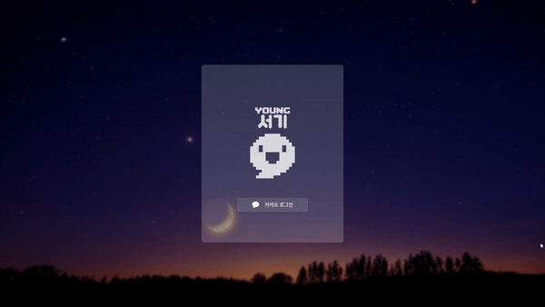
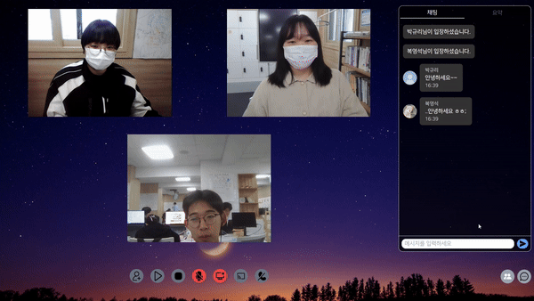
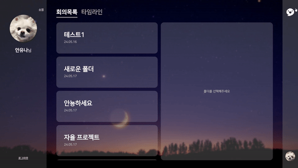
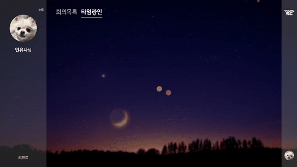
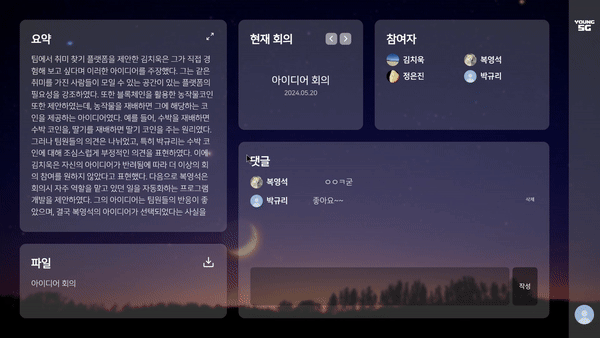
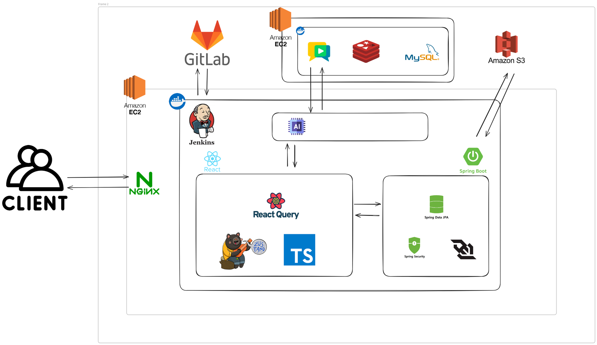

<h1 align="center">📃 YOUNG 서기 📃</h1>
<div align="center">
  <a href="https://www.notion.so/YOUNG-dbf21f6fc26249bab2262c023928229e" style="text-decoration: none; color: inherit;">
    
  </a>
  <a href="https://www.figma.com/design/mbKiQfGDvcyPwCDWCfTUxX/D208?node-id=0-1&t=LXkuBmEUdtvNieoi-0" style="text-decoration: none; color: inherit;">
    
  </a>
</div>

## 목차

- [📆 기간](https://github.com/YOUNG-SG/YOUNG-SG?tab=readme-ov-file#-%EA%B8%B0%EA%B0%84)
- [💡 서비스 소개](https://github.com/YOUNG-SG/YOUNG-SG?tab=readme-ov-file#-%EC%84%9C%EB%B9%84%EC%8A%A4-%EC%86%8C%EA%B0%9C)
- [💻 주요 기능 및 서비스 화면](https://github.com/YOUNG-SG/YOUNG-SG?tab=readme-ov-file#-%EC%A3%BC%EC%9A%94-%EA%B8%B0%EB%8A%A5-%EB%B0%8F-%EC%84%9C%EB%B9%84%EC%8A%A4-%ED%99%94%EB%A9%B4)
- [🛠 주요 기술](https://github.com/YOUNG-SG/YOUNG-SG?tab=readme-ov-file#-%EC%A3%BC%EC%9A%94-%EA%B8%B0%EC%88%A0)
- [🏗️ 아키텍처](https://github.com/YOUNG-SG/YOUNG-SG?tab=readme-ov-file#%EF%B8%8F-%EC%95%84%ED%82%A4%ED%85%8D%EC%B2%98)
- [📂 프로젝트 구조](https://github.com/YOUNG-SG/YOUNG-SG?tab=readme-ov-file#-%ED%94%84%EB%A1%9C%EC%A0%9D%ED%8A%B8-%EA%B5%AC%EC%A1%B0)
- [📃 산출물](https://github.com/YOUNG-SG/YOUNG-SG?tab=readme-ov-file#-%EC%82%B0%EC%B6%9C%EB%AC%BC)
- [📋 발표자료](https://github.com/YOUNG-SG/YOUNG-SG?tab=readme-ov-file#-%EB%B0%9C%ED%91%9C%EC%9E%90%EB%A3%8C)
- [🎞️ 영상](https://github.com/YOUNG-SG/YOUNG-SG?tab=readme-ov-file#%EF%B8%8F-%EC%98%81%EC%83%81)
- [👪 팀원](https://github.com/YOUNG-SG/YOUNG-SG?tab=readme-ov-file#-%ED%8C%80%EC%9B%90)

## 📆 기간

2024.04.08 ~ 2024.05.20 (6주)

## 💡 서비스 소개

```
회의록 작성에 집중하느라 회의에 소홀해지거나
회의에 참여하지 못해 회의 내용을 놓친 경험이 있으신가요?

YOUNG 서기는 회의 내용을 자동으로 정리 및 요약하고 회의록 파일을 생성해주는 서비스입니다.
서비스 이용을 통해 회의 참여도를 높이고, 문서화의 편리함을 느껴보세요!

"회의 참여도를 높이고 편리함을 제공하는 회의록 관리 서비스, YOUNG 서기"
```

## 💻 주요 기능 및 서비스 화면

<div align="middle">
  <table>
    <!---------- 1 ---------->
    <tr align="center"> 
      <td><strong>1. 로그인 페이지</strong><br/>회원가입 및 로그인</td>
      <td><strong>2. 메인화면</strong><br/>회의 생성</td>
    </tr>
    <tr align="center">
      <td></td>
      <td></td>
    </tr>
    <tr align="center">
      <td width="390px">카카오 로그인을 통해 회원가입 및 로그인을 진행합니다.</td>
      <td width="390px">회의명을 입력해 회의를 시작합니다. 회의를 시작한 사람이 방장이 됩니다.</td>
    </tr>
    <!---------- 2 ---------->
    <tr align="center">
      <td><strong>3. 회의진행</strong><br/>회의초대 및 채팅</td>
      <td><strong>3. 회의진행</strong><br/>모션 인식</td>
    </tr>
    <tr align="center">
      <td></td>
      <td></td>
    </tr>
    <tr align="center">
      <td width="390px">회의 링크 복사 및 공유를 통해 초대를 할 수 있습니다. 회의를 진행하며 녹음, 실시간 채팅, 화면 공유를 할 수 있습니다.</td>
      <td width="390px">모션 인식을 통해 손동작(🖐, 👍, 👎)을 인식할 수 있습니다.</td>
    </tr>
    <!---------- 3 ---------->
    <tr align="center">
      <td><strong>3. 회의진행</strong><br/>녹음 및 실시간 요약</td>
      <td><strong>3. 회의진행</strong><br/>방장 위임 및 회의종료</td>
    </tr>
    <tr align="center">
      <td></td>
      <td></td>
    </tr>
    <tr align="center">
      <td width="390px">녹음이 시작되면 STT를 통해 회의 참가자들이 나눈 내용을 글로 기록할 수 있습니다. 회의 내용이 저장된 DB를 조회하여 OpenAI로 요약 요청을 보냅니다. 요약 완료된 내용은 S3에서 불러온 회의록 양식에 맞춰 새로 작성된 후 S3와 DB에 저장됩니다.</td>
      <td width="390px">방장은 회의 종료 전 방장을 위임할 수 있습니다.</td>
    </tr>
    <!---------- 4 ---------->
    <tr align="center">
      <td><strong>4. 회의종료</strong><br/>폴더 추가 및 저장</td>
      <td><strong>5. 마이페이지</strong><br/>프로필 수정</td>
    </tr>
    <tr align="center">
      <td></td>
      <td></td>
    </tr>
    <tr align="center">
      <td width="390px">회의가 종료된 후, 폴더 추가 및 선택을 통해 회의를 저장할 수 있습니다.</td>
      <td width="390px">프로필 사진과 닉네임을 수정할 수 있습니다.</td>
    </tr>
    <!---------- 5 ---------->
    <tr align="center">
      <td><strong>5. 마이페이지</strong><br/>폴더별 회의목록 조회</td>
      <td><strong>5. 마이페이지</strong><br/>시간별 회의목록 조회 및 삭제</td>
    </tr>
    <tr align="center">
      <td></td>
      <td></td>
    </tr>
    <tr align="center">
      <td width="390px">폴더 목록과 폴더에 저장된 회의 목록을 조회할 수 있습니다.</td>
      <td width="390px">폴더 목록과 폴더에 저장된 회의 목록을 조회할 수 있습니다.</td>
    </tr>
    <!---------- 6 ---------->
    <tr align="center">
      <td><strong>6. 회의상세</strong><br/>회의 정보 및 댓글 작성</td>
      <td><strong>6. 회의상세</strong><br/>회의록 파일 다운로드</td>
    </tr>
    <tr align="center">
      <td></td>
      <td></td>
    </tr>
    <tr align="center">
      <td width="390px">회의 요약, 참여자, 같은 폴더 내 이전/다음 회의 조회, 댓글 작성 및 삭제를 할 수 있습니다.</td>
      <td width="390px">회의록 파일을 다운로드 받을 수 있습니다.</td>
    </tr>
  </table>
</div>

## 🛠 주요 기술

> **Frontend**

- Visual Studio Code(IDE) `1.85.1`
- HTML5, CSS3, Javascript(ES6)
- React `18.2.0`
- Vite `5.2.0`
- Nodejs `20.10.0`
- Typescript `5.2.2`
- Tanstack Query `5.29.2`
- Zustand `4.5.2`
- Tailwind CSS `3.4.3`
- axios `1.6.8`
- @tensorflow-models/handpose `0.1.0`
- fingerpose `0.1.0`
- openvidu-browser `2.29.1`
- react-speech-recognition `3.10.0`
- sockjs-client `1.6.1`
- stompjs `2.3.3`

> **Backend**

- IntelliJ `2023.3.2`
- Java OpenJDK `17`
- JWT : `0.12.5`
- Spring Boot `3.2.4`
  - JAVA Spring Data JPA
  - Spring Security
- Gradle
- ORM : JPA
- spring-boot-WebSocket
- STOMP

> **CI/CD**

- AWS EC2
  - NginX `1.18.0`
  - Ubuntu `20.04.6 LTS`
  - Docker `26.0.2`
  - Jenkins `2.443`
- Docker Hub

## 🏗️ 아키텍처



## 📂 프로젝트 구조

> Frontend

```java
src
├─ assets
│  └─ images
├─ components
│  ├─ common
│  ├─ login
│  ├─ main
│  ├─ meeting
│  ├─ meetingOn
│  ├─ myPage
│  └─ shared
├─ constants
├─ hooks
├─ pages
│  ├─ login
│  ├─ main
│  ├─ meeting
│  ├─ meetingOn
│  └─ myPage
├─ services
├─ store
├─ types
├─ utils
├─ App.css
├─ App.tsx
├─ index.css
└─ main.tsx
```

> Backend

```java
src
├─ main
│  ├─ java
│  │  └─ com
│  │     └─ d208
│  │        └─ AIclerk
│  │           ├─ chatting
│  │           │  ├─ controller
│  │           │  ├─ dto
│  │           │  │  ├─ requestDto
│  │           │  │  └─ responseDto
│  │           │  ├─ exception
│  │           │  ├─ repository
│  │           │  ├─ service
│  │           │  └─ util
│  │           ├─ common
│  │           ├─ config
│  │           ├─ entity
│  │           ├─ exception
│  │           ├─ meeting
│  │           │  ├─ controller
│  │           │  ├─ dto
│  │           │  │  ├─ requestDto
│  │           │  │  └─ responseDto
│  │           │  ├─ exception
│  │           │  ├─ repository
│  │           │  └─ service
│  │           ├─ member
│  │           │  ├─ controller
│  │           │  ├─ dto
│  │           │  │  ├─ requestDto
│  │           │  │  └─ responseDto
│  │           │  ├─ exception
│  │           │  ├─ repository
│  │           │  └─ service
│  │           ├─ security
│  │           │  ├─ exception
│  │           │  ├─ jwt
│  │           │  └─ oauth
│  │           └─ util
│  └─ resources
│     ├─ templates
│     └─ application.yml
└─ test
```

## 📃 산출물

1. [기능 명세서](https://www.notion.so/05d2f7bc704b4f5798c5979dbd3fb4f5?pvs=21)
2. [API 명세서](https://www.notion.so/API-7ccc244356d743e8b1e610b4071f6c98?pvs=21)
3. [와이어프레임](https://www.figma.com/file/mbKiQfGDvcyPwCDWCfTUxX/D208?type=design&node-id=0-1&mode=design&t=uDVwFg465bmduCrk-0)
4. [ER 다이어그램](https://www.erdcloud.com/d/P5YahL9LgoEt3C7AY)
5. [포팅 메뉴얼](https://www.notion.so/4e175b588e9048fa8642f700efd8be9a?pvs=21)

## 📋 발표자료

1. [중간 발표자료](https://www.canva.com/design/DAGC1ZF_I8A/VY0Av0xvN-PKo2_yf-2mlQ/edit)
2. [최종 발표자료](https://www.canva.com/design/DAGFWbjkb_M/EjsFo5Ou-7CaRaAuaarz-w/edit)

## 🎞️ 영상

- [UCC](https://www.youtube.com/watch?v=H4bQvtNhQTA&feature=youtu.be)
- [시연영상]()

## 👪 팀원

<div align="middle">
  <table>
    <tr>
      <td height="120px" align="center"> 
        <a href="https://github.com/kimchiuk">
          
        </a>
      </td>
      <td height="120px" align="center"> 
        <a href="https://github.com/PARK9YUR1">
          
        </a>
      </td>
      <td height="120px" align="center"> 
        <a href="https://github.com/BokAndYoung">
          
        </a>
      </td>
    </tr>
    <tr>
      <td width="280px" align="center">
        <strong>🥨 김치욱</strong>
        <br/>Frontend
      </td>
      <td width="280px" align="center">
        <strong>🍪 박규리</strong>
        <br/>Frontend
      </td>
      <td width="280px" align="center">
        <strong>🍞 복영석</strong>
        <br/>Backend
      </td>
    </tr>
    <tr>
      <td>
        <ul>
          <li>화상 채팅 기능 구현</li>
          <li>채팅방 기능 구현</li>
          <li>STT 기능 구현</li>
          <li>모션 인식 기능 구현</li>
        </ul>
      </td>
      <td>
        <ul>
          <li>로그인 페이지 화면 및 기능 구현</li>
          <li>메인 페이지 화면 및 기능 구현</li>
          <li>회의 상세 페이지 화면 및 기능 구현</li>
          <li>마이페이지 화면 및 기능 구현</li>
          <li>피그마 디자인 작업</li>
        </ul>
      </td>
      <td>
        <ul>
          <li>화상 채팅 기능 구현</li>
          <li>채팅방 기능 구현</li>
          <li>모션 인식 기능 구현</li>
          <li>실시간 기능 구현</li>
        </ul>
      </td>
    </tr>
    <tr>
      <td height="120px" align="center"> 
        <a href="https://github.com/YUNA-AHN">
          
        </a>
      </td>
      <td height="120px" align="center"> 
        <a href="https://github.com/Limkyuhwan">
          
        </a>
      </td>
      <td height="120px" align="center"> 
        <a href="https://github.com/jin5718">
          
        </a>
      </td>
    </tr>
    <tr>
      <td width="280px" align="center">
        <strong>🥞 안유나</strong>
        <br/>Backend
      </td>
      <td width="280px" align="center">
        <strong>🍮 임규환</strong>
        <br/>Backend
      </td>
      <td width="280px" align="center">
        <strong>🍩 정은진</strong>
        <br/>Backend
      </td>
    </tr>
    <tr>
      <td>
        <ul>
          <li>Infra</li>
        </ul>
      </td>
      <td>
        <ul>
          <li>OpenAI API 연결</li>
          <li>마이페이지 API 기능 구현</li>
          <li>회의 요약 API 기능 구현</li>
          <li>폴더 관련 API 기능 구현</li>
        </ul>
      </td>
      <td>
        <ul>
          <li>소셜 로그인 기능 구현</li>
          <li>JWT 를 이용한 Spring Security</li>
          <li>회의록 작성 기능 구현</li>
        </ul>
      </td>
    </tr>
  </table>
</div>
